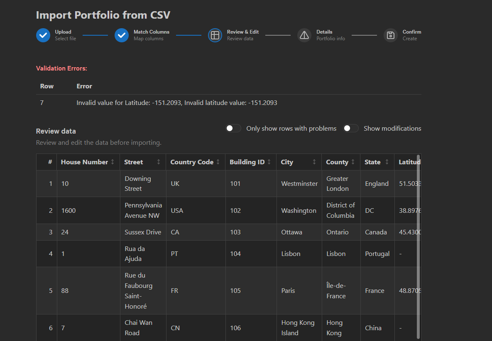

# PFMan (Portfolio Manager) Coding Exercise

This repository contains the AZX "PFMan" (Portfolio Manager) coding exercise.

## Repo Structure

This repo is split into two parts:

- `src`: A Python FastAPI application that serves as a backend API.
- `client`: A React frontend application that interacts with the backend API.

## Required Tools

1. Docker

[Docker desktop](https://docs.docker.com/desktop/) is recommended.

2. `python` and `uv` (for backend development)

[python](https://www.python.org/downloads/) and [uv](https://docs.astral.sh/uv/getting-started/installation/)

3. Node.js and `pnpm` (for client-side development)

- [nvm](https://github.com/nvm-sh/nvm?tab=readme-ov-file#installing-and-updating) is recommended for managing Node.js versions on linux and macOS.
- [pnpm](https://pnpm.io/installation) is used as the package manager for this project.


## Running the Application

### Backend

To run the backend first start the supporting services with Docker:

```bash
docker-compose up -d
```

Then, install dependencies:

```bash
uv sync
```

Finally, run the application from the root of the repository:

```bash
uv run fastapi dev ./src/pfman/app.py --reload
```

### Frontend

Navigate to the `client` directory

```bash
cd client
```

Then install dependencies:

```bash
pnpm install
```

Finally, start the development server:

```bash
pnpm dev
```

## API Schema Browser

Once the backend server is running, you can navigate your browser to [http://localhost:8000/docs](http://localhost:8000/docs) or [http://localhost:8000/redoc](http://localhost:8000/redoc) to view the documentation of the very limited toy API.

You can also view the OpenAPI schema directly at [http://localhost:8000/openapi.json](http://localhost:8000/openapi.json).

## Background

AZX is working with a large commercial real estate company to deliver a commercial real estate portfolio management and intelligence platform which uses AI to help drive portfolio decarbonization and compliance initiatives across the company.

The platform will consist of a knowledge graph of real estate portfolios and the properties they include, and will be enriched with data from additional sources, both internal and external, to give a consolidated view of the assets being managed.

## Exercise

The exercise is to implement a portfolio import wizard to allow a user to upload a csv of properties, and create a portfolio.

The portfolio import wizard component is stubbed at [PortfolioImport.page.tsx](./client/src/pages/PortfolioImport.page.tsx) and can be opened by pointing your browser to [http://localhost:3000/portfolio/import](http://localhost:3000/portfolio/import).

A few sample input portfolios are provided in the [data](./data/) folder to give you an idea of the types of input the wizard is expected to work with.

The wizard should have the following steps:

1. Select a CSV file

This screen should allow a user to pick a .csv file from their device from which to create the portfolio.

There should be a "Download Template" link on the page which downloads an empty csv with all of the fields supported by the Address input model.

*OPTIONAL Extension*: allow a csv file to be drag and dropped onto the page instead of located via file picker.


2. Match input CSV columns to the "Address" input model.

Users at the company currently store their portfolios in all manner of tools and formats, so we need to support a flexible input schema.

Provide a UI to allow users to match columns from the input CSV to properties on the [Address Model](./src/pfman/models/Address.py).

- Columns should be mappable to at most one property on the Address model
- Properties on the Address model should be mapped from at most one input column
- To successfully geocode a property into the knowledge graph, at least one of the following sets of columns must be matched:
    - Formatted Address AND country/country code
    - Address Line AND city AND country/country code
    - Building Name/Number AND city AND country/country code
    - Latitude AND Longitude
- Columns which are not required can be ignored
- The wizard should suggest "best matches" for column mappings
- Users cannot proceed until every column is either mapped, or ignored, and the mapped column requirements are met.


3. Review and Edit

Once the columns are mapped, the wizard should let the user review the mapped data and fix any issues.

- Show a data table of mapped columns input rows
- Highlight invalid values
- Allow the user to edit values
    - Editing can be in place, or in a modal/popup
- Allow the user to filter the view to show only invalid rows
- Allow the user to filter to view rows where the original data was edited




4. Once the import data is confirmed, the user should be presented a step to enter the portfolio detail; title and description.

- The user should not be able to proceed until at least the title is provided.


5. With a title provided, the user should be shown a final review page with a recap of the portfolio to be created, with the title, description (if provided) and number of properties to be created.

If the user chooses to create the portfolio, a POST request should be made to `/api/portfolio` with a [CreatePortfolioPayload](./src/pfman/routes/portfolio.py) as body.


## Important Information

- This exercise is intended to be more than even the most superhuman dev could hope to achieve in the allowed time; this is by design.  You are *not* expected to complete everything!
- Most people (probably) haven't worked with Mantine before.  The nature of the work that we do means that sometimes we are required to jump in and work in unfamiliar codebases with libraries or frameworks that we haven't used; part of the exercise is to see how quickly you can get stuck in working with something new.
- Many useful libraries are already included in the project, but you are free to add any others.
- Some of the specs are deliberately ambiguous or omitted.  Part of the exercise is to give you opportunity to fill in the gaps left by imperfect requirements.
- Additional "boilerplate" files have been added to make the codebase feel more "real", but a lot of it isn't actively used and doesn't *need* to be modified as part of this exercise.  That being said, *anything* in the repo is fair game (e.g. restructuring routes, boilerplate layout, adding additional state management context providers, stores etc.)

## Hints

- The most important part of this exercise is the column matching and general state management for the wizard flow.
- The focus is not on design; reference screenshots are provided to give you an idea for a UI you can work towards, but if you think you can do better, feel free!
- Columns that can reasonably be validated, should be.
- The implementation of suggested column mappings, and row validation can be implemented in either the front-end, or the back-end.
- If there is a requirement you're really not sure about, ask.  Engineering is a team sport, so whilst we'd like to see how far you can get with the provided information, if you're stuck on something reach out and we'll help get you unstuck.